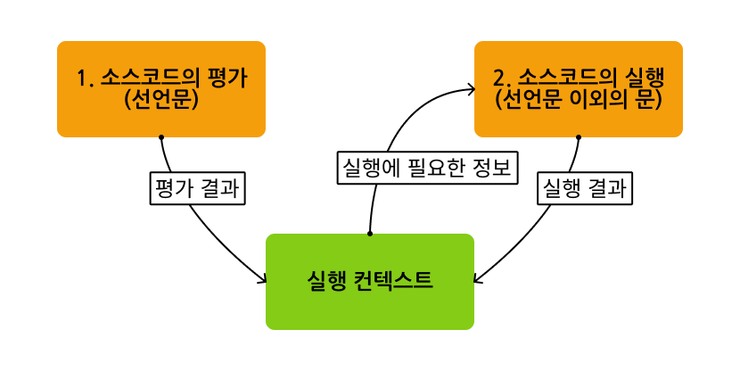

# 프로그래밍 🔥

## 프로그래밍이란 뭐라고 생각하나요?

- 특정 목적을 달성하기 위해 설계된 알고리즘을 프로그래밍 언어를 사용하여 구체적인 프로그램으로 작성하는 것

## 컴파일러는 뭐고 인터프리터는 뭔가요? 🔥

- 컴파일러
  - 컴파일을 실행하는 프로그램
  - 일반적으로 고급 언어로 작성된 코드를 이진 코드/기계코드라고 하는 실행 가능한 코드로 변환
- 인터프리터
  - 우리가 작성한 코드를 소스파일로 바로 실행시켜주는 프로그램

### 컴파일러와 인터프리터 차이

| 컴파일러                 | 인터프리터                                                       |
| ------------------------ | ---------------------------------------------------------------- |
| 소스파일을 한 줄씩 해석  | 전체 프로그램 코드를 스캔하고 코드 전체를 통째로 목적코드로 변환 |
| 소스 코드 해석 시간 적음 | 소스 코드 해석 시간 많음                                         |
| 실행 시간 느림           | 실행 시간 빠름                                                   |

### 컴파일이란?

- 한 언어로 작성된 프로그램을 다른 언어의 동등한 프로그램으로 변환하는 프로세스
- 한 언어로 작성된 소스 코드를 다른 언어로 변환하는 것
- assembling 또는 build라고도 함

### 컴파일 언어의 장단점

- 장점
  - 프로그램의 오류를 실행 없이 발견 가능
  - 처음 컴파일 과정 이후에는 해석된 파일로 재실행을 하여 여러 번 반복적인 실행이 필요할 때 인터프리터 언어보다 빠르게 동작
  - 기계어에 좀 더 가까운 저수준 언어이기 때문에 인터프리터 언어보다 더 적은 메모리로 동일한 코드 실행 가능
- 단점
  - 운영체제마다 사용하는 기계어가 달라지기 때문에, 별도의 처리 필요
  - 규모가 클수록 컴파일 과정 자체가 오랜 시간이 걸림
  - 저수준 언어에 가깝기 때문에 사용이 어려움
    => 수정이 자주 발생하는 소프트웨어에서는 빠른 개발과 유지보수, 동적인 환경에 유연한 인터프리터 언어가 효율적일 수 있음

# 자바스크립트란 🔥

## 자바스크립트의 특징은 뭐가 있나요?

1. 웹 핵심 구성 요소

- HTML, CSS와 함께 웹을 구성하는 요소 중 하나
- 웹 브라우저에서 DOM을 직접 조작 할 수 있는 유일한 프로그래밍 언어

2. 인터프리터 언어 및 JIT 컴파일

- 코드를 한 줄씩 실행하는 인터프리터 언어
- 브라우저 엔진에 따라 성능 향상을 위해 JIT 컴파일러를 사용하여 컴파일 과정을 거치기도 함
  (인터프리터와 컴파일러의 장점을 결합해 비교적 처리 속도가 느린 인터프리터의 단점 해결)

3. +동적 타입 언어

- 변수의 타입이 런타임에 결정
- 유연한 코딩과 빠른 프로토타이핑 가능
- 타입 오류가 런타임에 발생할 수 있어 주의 필요

4. 멀티 패러다임 프로그래밍 언어

- 명령형, 함수형, 프로토타입 기반 객체지향 프로그래밍 지원
- 문제 해결에 적합한 프로그래밍 스타일을 선택 가능

5. +싱글 스레드 방식과 이벤트 루프

- 자바스크립트 엔진은 단 하나의 실행 컨텍스트 스택(콜스택)를 가짐
- 기본적으로 하나의 스레드에서 실행하므로 동기로 동작
- 브라우저의 이벤트 루프를 활용하여 멀티스레드, 비동기적 동작도 구현 가능

6. +환경

- 브라우저뿐만 아니라 Node.js 등을 통해 서버 측 프로그래밍도 가능

### 자바스크립트가 웹 브라우저에서 동작하는 유일한 프로그래밍 언어인가?

- WebAssembly도 웹 브라우저에서 동작하는 언어이다.
- WebAssembly is a type of code that can be run in modern web browsers — it is a low-level assembly-like language \_mdn
  - 하지만 DOM에 직접 접근하는 것이 제한되어 있다.

[참고]

- https://developer.mozilla.org/en-US/docs/WebAssembly
- https://en.wikipedia.org/wiki/WebAssembly

### 자바스크립트에서의 JIT 컴파일러

> - JIT(Just-In-Time) - 런타임에 컴파일 (<-> AOT(Ahead-of-Time) - 서버에서 미리 컴파일)
> - JIT 컴파일러
>   - 인터프리터 언어의 실행과 동시에 컴파일이 가능하도록 만든 동적 컴파일러
>   - 소스 코드를 파싱 하면서 중간언어로 먼저 변환
>   - 모드에 따라서 다르게 수행 (인터프리터 - 바이트 코드 하나씩 읽음, JIT 모드 - 바이트 코드를 기반으로 컴파일하여 동작)
>   - 보편적인 케이스를 제외하고는 비효율적이라고 판단하면 slow case로 넘겨서 인터프리터 실행

- 자바스크립트는 동적 타입 언어이기 때문에 자바스크립트 엔진에서는 동적 타입에서의 모든 예외 처리를 고려해야 함
  - slow case로 실행하는 인터프리터 동작의 비중이 높을 수 밖에 없으며, JIT는 컴파일할 시 컴파일로 인한 과부하(compliation overhead)가 발생하기 때문에 자바스크립트 엔진에서는 비효율적
  - 최적화할 부분(Hot Spot)에 대해서도 적을 수 있기 때문에 자바스크립트 엔진을 위한 최적화가 필수적으로 요구됨
- 적응형 JIT 컴파일러(AJITC: Adaptive Just In Time Complier)
  - 실행하는 자바스크립트 코드에 적응하는 JIT 컴파일러
  - 모든 바이트코드를 네이티브 코드로 컴파일하지 않고, 프로파일링을 도입하여 최적화할 코드 선별
  - 선별한 코드만 컴파일하여 컴파일로 인한 과부하를 최소화하고 최적화할 부분에 대해서도 해결

[참고]

- https://blog.cinntiq.synology.me/jit/

# 변수 🔥

## 변수란 무엇인가요?

- 하나의 값을 저장하는 메모리 공간에 상징적인 이름을 붙인 것

### 메모리에 저장된 값에 직접 접근하는 게 아닌 변수를 사용하는 이유가 무엇인가요?

- 사용자가 직접적으로 접근하게 되면
- 실수로 운영체제가 사용하고 있는 값을 변경하면 시스템을 멈추게 하는 등 의도치 않게 문제 발생할 수 있음
- 값이 저장될 메모리 주소가 코드가 실행될 때마다 메모리 상황에 따라 임의로 결정되어 코드 실행 전 값이 저장된 메모리를 알 수 없음
- 따라서 자바스크립트는 개발자의 직접적인 메모리 제어를 허용하지 않음

### 변수 사용 장점

- 변수에 저장된 값의 의미를 명확하게 할 수 있음 -> 가독성을 높임

## 식별자란 무엇인가요? 🔥

- 어떤 값을 구별해서 식별할 수 있는 고유한 이름, 메모리 주소에 붙인 이름
- 변수이름에만 국한해서 사용하는 것은 아님 - 변수, 함수, 클래스 등 메모리 상에 존재하는 어떤 값을 식별할 수 있는 이름은 모두 식별자
- (값이 아닌) 값이 저장되어 있는 메모리 주소와 매핑 관계를 맺음

## 변수를 선언한다는 것은 어떤 것을 의미하나요?

- 값을 저장하기 위한 **메모리 공간을 확보**하고 **변수 이름과 확보된 메모리 공간의 주소를 연결**해서 값을 저장할 수 있게 준비하는 것
- 자바스크립트 엔진의 변수 선언 2단계
  1. 선언 단계: 변수 이름을 [실행 컨텍스트](#실행-컨텍스트에-대해-말해보세요-)에 등록
  2. 초기화 단계: 값 저장을 위한 메모리 공간 확보 (undefined 값 암묵적 할당)

### 왜 초기화 단계를 거치는 걸까?

- 메모리 공간을 확보한 후, 값을 할당(초기화)하지 않은 상태에서 곧바로 변수 값을 참조하면 확보된 메모리 공간에 이전에 사용하던 값(쓰레기 값)이 나올 수 있음

### 선언하지 않은 식별자에 접근하면 어떻게 될까?

- ReferenceError 발생하기
- ```js
  // QUIZ
  typeof test; // undefined
  ```

  typeof 연산자는 내부적으로 문자열을 반환하도록 처리되기 때문에 선언하지 않은 식별자의 경우 ReferenceError 발생하지 않고 undefined 반화 (TDZ에서는 ReferenceError)

### 변수 선언의 실행 시점은?

- 코드 평가 단계
- 따라서 실행 시점(런타임)에서 참조 가능 -> [호이스팅](#호이스팅이-뭔가요-)
- +할당은 런타임에 실행

#### 소스코드의 평가와 실행 (p361)



- 위 그림에서 실행 컨텍스트는 구체적으로 실행 컨텍스트가 관리하는 스코프(렉시컬 환경의 환경 레코드)

## var 키워드는 뭔가요?

- ES6에서 let, const 키워드 도입 전, 변수 선언 유일 키워드
- 선언 단계와 초기화 단계 동시에 진행
- 함수 레벨 스코프
- 재할당 가능
- 같은 스코프 내, 중복 선언 가능
- var 키워드로 선언한 변수는 전역 객체의 프로퍼티가 됨

### 키워드란?

- 자바스크립트 코드를 해석하고 실행하는 자바스크립트 엔진이 수행할 동작을 규정한 일종의 명령어

### 재할당 시 메모리 공간

- 기존 값이 있던 메모리 공간에 재할당 값을 새로 저장하는 것이 아닌,
- 새로운 메모리 공간을 확보하고 그 메모리 공간에 재할당 값 저장
- 어떤 식별자와도 연결되어 있지 않은 기존 값의 경우 [가비지 콜렉터](#자바스크립트의-가바지-컬렉션에-대해-알고-있나요)에 의해 메모리에서 자동 해제

## 호이스팅이 뭔가요? 🔥🔥

- 변수의 선언 단계는 런타임 이전에 실행되며, 실행 컨텍스트 안에 식별자 정보(key - 변수 이름, value - 변수 값) 저장
- 변수 선언이 맨 처음 실행되어, 마치 스코프 최상단에 위치한 것처럼 보이기 때문에, 호이스팅이라고도 함

### let이나 const는 호이스팅이 발생하지 않나요?

- var과 let, const 모두 호이스팅이 일어남
- var은 선언과 동시에 초기화가 일어나서 값 할당 전 reference에러가 발생하지 않음
- let과 const는 선언과 초기화가 분리되어 일어나서 선언과 초기화 사이인 [일시적 사각 지대](#tdz-)에서는 reference에러 발생

## var 키워드의 문제점은 무엇이 있나요? 🔥 (모던 JS 15장 p208)

- 변수 중복 선언 허용 -> 의도치 않게 먼저 선언된 변수 값 변경 가능
- 함수 레벨 스코프 -> 함수 외부 코드 블록 내 선언한 변수는 전역 변수가 됨 -> 번역 변수 중복 선언 발생 가능
- 변수 호이스팅 -> 변수 선언문 이전 변수 참조 시 에러는 발생하지 않지만 프로그램 흐름상 맞지 않고, 가독성 떨어지고, 오류 발생 여지 있음

## let 키워드는 var 키워드와 어떤 점이 다른가요? 🔥🔥

[let]

- ES6에서 도입
- 코드 평가 시 선언 단계, 코드 실행 시 초기화 단계 -> 사이 구간을 [TDZ](#tdz-)라고 함
- 블록 레벨 스코프
- 재할당 가능 (동일)
- 같은 스코프 내, 중복 선언 불가능

vs [var 키워드는 뭔가요?](#var-키워드는-뭔가요)

## const 키워드는 어떤 특징이 있나요? 🔥

- ES6에서 도입
- 코드 평가 시 선언 단계, 코드 실행 시 초기화 단계 -> 사이 구간을 [TDZ](#tdz-)라고 함
- 블록 레벨 스코프
- 재할당 불가 (선언과 동시에 초기화)
- 같은 스코프 내, 중복 선언 불가능

### const는 값 변경이 불가능 한데, const로 선언한 객체를 수정할 수 있는 이유는 무엇인가요?

- const 객체 변수는 값이 아닌 값이 저장되는 메모리힙 주소가 콜스택에 할당
- 객체 주소 자체를 변경하는 게 아닌 객체 내부 프로퍼티를 변경할 경우에는 변수에 값을 재할당 한게 아닌 메모리 힙에 저장된 값이 변경되는 것
- 실제로 콜스택에 저장된 메모리힙 주소는 변경된 부분이 없음

## TDZ 🔥🔥

- 일시적 사각지대
- 스코프 시작 지점부터 초기화 시작 지점까지 변수를 참조할 수 없는 구간
- TDZ에서 변수를 사용하려고 하면 ReferenceError 발생
- let, const, class를 사용한 선언문등\*에서 발생

[참고]

- \*https://ui.toast.com/weekly-pick/ko_20191014

## 식별자 네이밍 규칙은 어떤 것들이 있나요?

- 예약어는 식별자로 사용 X
- $, \_가 아닌 특수 문자 사용 X
- 숫자로 시작 X
- 대소문자 구분

### 예약어 중 let도 식별자로 사용이 불가능 한가요?

- 아직 예약어로 등록되지 않았지만 strict 모드에서는 예약어로 취급하여 식별자 불가능

## 네이밍 컨벤션은 어떤 것들이 있나요?

- camelCase - 식별자의 첫글자 소문자, 각 단어 구분 시 단어 첫 글자 대문자
- PascalCase - 식별자의 첫글자 대문자, 각 단어 구분 시 단어 첫 글자 대문자
- snake_case - 소문자로 구성, 각 단어 구분 시 단어 사이 \_
- UPPER_SNAKE_CASE - 대문자로 구성, 각 단어 구분 시 단어 사이 \_

## 리터럴이 뭔가요?

- 사람이 이해할 수 있는 문자 또는 약속된 기호를 사용해 값을 생성하는 표기법
- 자바스크립트 엔진은 런타임에 리터럴을 평가해 값을 생성함

# 데이터 타입 🔥

## 데이터 타입의 종류는 어떤 것들이 있나요? 🔥

원시타입 - Number, String, Boolean, null, undefined, Symbol, BigInt(ES11에 추가)이 있음
객체 타입 - 함수, 배열, 객체 등 원시타입이 아닌 타입

### 자바스크립트의 Number 타입은 다른 언어들과 어떤 차이점이 있나요?

- 하나의 숫자 타입만 존재 -> 정수, 실수 구분 없이 모두 실수로 처리
- 배정밀도 64비트 부동소수점 형식을 따름
- 진수가 달라도 2진수로 저장되며, 읽을 때는 모두 10진수로 해석됨

### 문자열 타입인 템플릿 리터럴의 장점은?

- 멀티 라인
- 표현식 삽입
- 태그드 템플릿

### 태그드 템플릿이란?

```js
function tag(strings, ...values) {
  // strings: 문자열 부분이 배열로 전달
  // values: 삽입된 표현식들이 배열로 전달
}

const name = "Alice";
const age = 25;

tag`Hello, ${name}! You are ${age} years old.`;
```

[참고]

- https://developer.mozilla.org/en-US/docs/Web/JavaScript/Reference/Template_literals#tagged_templates

### 객체 타입 내부 값들은 어떻게 여러 타입이 가능한가요?

- 메모리 공간 크기가 런타임에 결정되기 때문에 타입 체크 후 메모리 할당이 가능

### undefined vs null

- 서로 다른 데이터 타입
- undefined는 개발자가 의도적으로 할당하기 위한 값이 아니라 자바스크립트 엔진이 변수를 초기화할 때 사용
- null은 개발자가 변수에 값이 없음을 의도적으로 명시할 때 사용 (이전에 참조하던 값을 더 이상 참조하지 않게다는 의미 -> 이전 값 참조 명시적 제거 -> 가비지 콜렉션 수행)

## 심벌 타입은 뭐죠?

- 변경 불가한 원시 값
- 중복 불가
- 객체 속성 중복을 허용하지 않기 위해 주로 사용
- 심벌 값에 대한 설명이 같더라도 유일무이한 심벌 값을 생성

  ```js
  const symbol1 = Symbol("symbol");
  const symbol2 = Symbol("symbol");

  console.log(symbol1 === symbol2); //false
  ```

- 문자열, 숫자와의 연산에도 암묵적으로 문자열이나 숫자 타입으로 변환되지 않음 (boolean으로는 암묵적 변환됨)
- js에서 enum(명명된 숫자 상수 집합)을 흉내내기 위해 Object.freeze()와 심벌 값 사용

## 데이터 타입은 왜 필요할까요? 🔥

- 값 저장 시 확보할 메모리 공간 크기 결정
- 값 참조 시 읽을 메모리 공간 크기 결정
- 2진수 어떻게 해석할 지 결정

## 정적 타이핑이 뭔가요?

- 선언 시점에 변수의 타입을 지정해주는 방식
- 컴파일 시점에서 타입 체크
- ex. C, 자바, TypeScript
- 👍 타입 일관성을 강제함으로써 더욱 안정적인 코드 구현으로 런타임에 발생하는 에러 줄임

## 동적 타이핑이 뭔가요?

- 코드를 사용하는 사용자가 직접 자료형을 지정해주지 않고, 컴퓨터가 자료형을 추론해서 지정하는 방식
- 런타임 시점에서 자료형 결정
- 👍 빠르게 개발 가능, 유연
- 👎 의도치 않게 자료형이 바뀌어도 오류로 인식하지 않아 프로그램 실행 시 문제 발생 가능, 유지보수가 힘듦
- ex. JavaScript, Python

### 자바스크립트 변수는 타입을 가질까?

- 자바스크립트는 동적 타입 언어
- 자바스크립트 변수는
  - 선언이 아닌 할당에 의해 타입 결정
  - 재할당에 의해 변수 타입 동적으로 변할 수 있음
- 따라서 변수는 타입을 갖지 않고, 값이 타입을 가짐

# 타입변환과 단축 평가 🔥

## 명시적 타입 변환이 뭔가요?

- 타입 캐스팅이라고도 함
- 개발자가 의도적으로 타입 변환

## 명시적 타입 변환 함수를 예를 들어볼 수 있나요?

- 표준 빌트인 생성자 함수에 new 없이 호출하여 타입 변환 가능
- toString, parseInt, parseFloat등 메소드로 타입 변환 가능

### 생성자 함수를 사용하여 타입을 변환할 때 new 연산자 없이 호출하는 이유는 무엇인가요?

- new 연산자와 같이 호출하면 객체 타입으로 지정되기 때문에 원시 타입으로 변환하기 위해 new 연산자 없이 호출

## 암묵적 타입 변환이 뭔가요?

- 타입 강제 변환이라고도 함
- 자바스크립트 엔진에 의한 의도하지 않은 타입 변환
- 문자열 연결 연산자 -> 문자로 타입 변환
- 산술 연산자 -> 숫자로 타입 변환

## truthy / falsy 한 값이 뭔가요?

- Falsy값은 false로 평가되는 값. false, 빈문자열, +0, -0, NaN, null, undefined
- Truthy값은 Falsy값이 아닌 true로 평가되는 값. 비어있지 않은 문자열, 0이 아닌 숫자, 객체, 배열 등

# 배열 🔥

## 자바스크립트의 배열은 자료구조의 배열과 같나요?

- 자바스크립트 배열은
  - 일반적인 배열의 동작을 흉내낸 해시 테이블로 구현된 객체
  - 어떤 타입의 값이라도 배열의 요소가 될 수 있음
  - 밀집되지 않아도 됨
  - 일반 배열보다 접근은 느리지만 삽입 삭제가 빠름

## 배열의 메서드는 어떤 종류가 있나요?

```js
// 정적 메서드
Array.from();
Array.fromAsync();
Array.isArray();
Array.of();
```

```js
// 인스턴스 메서드
Array.prototype.at()
Array.prototype.concat()
Array.prototype.copyWithin()
Array.prototype.entries()
Array.prototype.every()
Array.prototype.fill()
Array.prototype.filter()
Array.prototype.find()
Array.prototype.findIndex()
Array.prototype.findLast()
Array.prototype.findLastIndex()
Array.prototype.flat()
Array.prototype.flatMap()
Array.prototype.forEach()
Array.prototype.includes()
Array.prototype.indexOf()
Array.prototype.join()
Array.prototype.keys()
Array.prototype.lastIndexOf()
Array.prototype.map()
Array.prototype.pop()
Array.prototype.push()
Array.prototype.reduce()
Array.prototype.reduceRight()
Array.prototype.reverse()
Array.prototype.shift()
Array.prototype.slice()
Array.prototype.some()
Array.prototype.sort()
Array.prototype.splice()
Array.prototype[@@iterator]()
Array.prototype.toLocaleString()
Array.prototype.toReversed()
Array.prototype.toSorted()
Array.prototype.toSpliced()
Array.prototype.toString()
Array.prototype.unshift()
Array.prototype.values()
Array.prototype.with()
```

## 고차 함수에 대해서 아나요?

- 함수를 인수로 전달받거나 함수를 반환하는 함수
- 외부 상태의 변경이나 가변 데이터를 피하고 불변성을 지향하는 함수형 프로그래밍에 기반을 둠
- 자바스크립트의 함수는 일급 객체이므로 함수를 값처럼 인수로 전달할 수 있으며, 반환할 수도 있다.

### 함수형 프로그래밍이란

- 순수 함수와 보조 함수의 조합을 통해 로직 내에 존재하는 조건문과 반복문을 제거하여 복잡성을 해결하고 변수의 사용을 억제하여 상태 변경을 피하려는 프로그래밍 패러다임

## forEach 메서드와 map메서드의 차이점에 대해 알고 있나요?

- 공통점
  - 자신을 호출한 배열의 모든 요소를 순회하면서 인수로 전달받은 콜백 함수를 반복 호출
- 차이점
  - forEach
    - undefined 반환
  - map
    - 콜백 함수의 반환값들로 구성된 새로운 배열 반환

# 객체 리터럴 🔥

## 자바스크립트에서 객체란 뭘까요?

- 다양한 타입의 값을 하나의 단위로 구성한 복합적인 자료구조
- 0개 이상의 프로퍼티(key와 value로 구성)로 구성된 집합
- 프로퍼티(상태)와 메서드(동작)로 구성된 집합체
- 변경 가능한 값
- 원시 값을 제외한 나머지 값은 모두 객체

## 함수와 메서드의 차이점에 대해 알고 계신가요?

- 프로그래밍 언어의 함수
  - 일련의 과정을 문으로 구현하고 코드 블록으로 감싸서 하나의 실행 단위로 정의한 것
- 일반적인 메서드
  - 메서드는 객체에서 프로퍼티 값으로 함수를 사용하는 경우
  - 프로퍼티 값이 함수일 경우 일반 함수와 구분하기 위해 메서드라고 부름
  - 즉, 객체에 바인딩된 함수

### ES6에서의 함수와 메서드

- ES6 이전 함수
  - ES6 이전까지 자바스크립트 함수는 다양한 목적으로 사용 (-> 👎 사용 목적이 구분 안 됨)
    - 일반적인 함수로서 호출 가능
    - new 연산자와 함께 호출하여 생성자 함수로서 호출 가능
    - 객체에 바인딩되어 메서드로서 호출 가능
      => 모든 함수는 callable이면서 constructor 였음
- ES6 함수

  - 사용 목적에 따라 3가지 종류로 명확히 구분
    | ES6 함수 구분 | constructor | prototype | super | arguments |
    | ---|---|---|---|---|
    |일반 함수|O|O|X|O|
    |메서드|X|X|O|O|
    |화살표 함수|X|X|X|X|

- ES6 메서드
  - ES6 이전 사양에서는 명확한 정의 없이 객체에 바인딩된 함수를 일컫는 의미로 사용 (26.2장)
  - ES6 사양에서 메서드는 메서드 축약 표현으로 정의된 함수만을 의미한다고 명확하게 규정됨
  - 인스턴스를 생성할 수 없는 non-constructor기 때문에 new와 함께 생성자 함수로서 호출 불가
  - 내부 슬롯 [[HomeObject]]를 가지므로 super 키워드를 사용할 수 있다.
  - => 메서드를 정의할 때 프로퍼티 값으로 익명 함수 표현식을 할당하는 ES6 이전 방식은 사용하지 않는 것이 좋다.

## 자바스크립트에서 객체를 생성하는 방법은 어떤 것들이 있나요?

- 객체 리터럴
- Object 생성자 함수
- 생성자 함수
- Object.create 메서드
- 클래스

### 인스턴스란?

- 클래스에 의해 생성되어 메모리에 저장된 실체

# 원시 값과 객체 비교 🔥

## 동적 타이핑을 지원하는 자바스크립트에서 데이터의 타입을 크게 2개로 나누는 이유가 있을까요? 🔥

| 원시 타입        | 객체 타입                           |
| ---------------- | ----------------------------------- |
| 변경 불가능      | 변경 가능                           |
| 콜스택에 값 저장 | 콜스택에 주소 저장 - 값은 힙에 저장 |
| 값에 의한 전달   | 참조에 의한 전달                    |

## 값에 의한 전달이 뭔가요? 🔥

- 원시 값 할당 시 원시 값이 복사되어 전달되는 것

## 참조에 의한 전달이 뭔가요? 🔥

- 원본의 참조 값이 복사되어 전달되는 것

### 자바스크립트에서의 전달

- 식별자가 기억하는 메모리 공간에 저장되어 있는 값을 복사해서 전달한다는 면이 동일 (참조값이냐, 원시값이냐의 차이)
- 따라서 자바스크립트에는 "참조에 의한 전달"은 존재하지 않고 "값에 의한 전달"만이 존재한다고 할 수 있음 -> "공의에 의한 전달"이라고 표현하기도 함 (자바스크립트)

# 함수 🔥

## 자바스크립트에서 함수를 정의하는 방법은 몇가지가 있나요?

- 함수 선언문
- 함수 표현식
- Function 생성자 함수
- 화살표 함수(ES6)

## 함수 선언문과 함수 표현식은 어떤 차이가 있나요?

- 함수 선언문
  - 함수 이름 생략 불가
  - 표현식이 아닌 문
  - 런타임 이전에 함수 객체로 초기화
- 함수 표현식
  - 함수 이름 생략 가능 (익명 함수)
  - 표현식인 문
  - 런타임에 함수 객체 초기화
- 함수를 호출하기 전에 함수를 선언해야 한다는 규칙에 의해 함수 선언문 대신 함수 표현식 사용 권장

### 일반 함수와 화살표 함수의 차이는?

- 화살표 함수
  - 인스턴스를 생성할 수 없는 non-constuctor다.
  - 중복된 매개변수 이름을 선언할 수 없다.
  - 함수 자체의 this, arguments, super, new.target 바인딩을 갖지 않는다.
  - 콜백 함수 내부의 this 문제를 해결하기 위해 의도적으로 설계되었다.

## 즉시 실행 함수(IIFE)에 대해 알고 있나요? 알고 있다면 아는 내용에 대해 말해보세요

- 함수 정의와 동시에 즉시 호출되는 함수
- 단 한 번만 호출되며 다시 호출 불가
- 익명 함수를 사용하는 것이 일반적이나, 기명으로도 가능 (기명이라도 다시 호출 불가)

