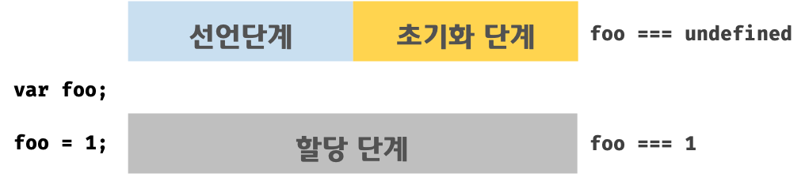

# 프로그래밍 🔥

## 프로그래밍이란 뭐라고 생각하나요?

- 프로그래밍은 컴퓨터가 주어진 작업을 수행할 수 있도록 명령을 작성하는 과정이다.

## 컴파일러는 뭐고 인터프리터는 뭔가요?

### 컴파일러(Compiler)

- 프로그래밍 언어로 작성된 소스 코드를 기계어로 번역하는 프로그램

  ### 장점

  - 컴파일된 프로그램은 실행 시 번역이 필요없어 실행 속도가 빠르다.
  - 컴파일 단계에서 문법 오류를 모두 확인하고 실행 전에 오류를 고칠 수 있다.

  ### 단점

  - 소스 코드가 크면 컴파일 하는데 오래 걸린다.
  - 컴파일된 실행 파일은 특정 운영체제나 환경에 종속되어 다른 환경에서 재컴파일이 필요할 수 있다.
  - 디버깅이 어렵다.

### 인터프리터(Interpreter)

- 프로그래밍 언어로 작성된 코드를 **한 줄씩** 읽고 해석하여 즉시 실행하는 프로그램이다.

  ### 장점

  - 코드를 수정하고 바로 실행할 수 있어 코드 작성과 테스트가 빠르다.
  - 한 줄씩 실행하기 때문에 디버깅이 편리하다.
  - 특정 플랫폼에 종속되지 않아 여러 운영체제에서 동일하게 실행할 수 있다.

  ### 단점

  - 한 줄씩 번역하기 때문에 컴파일된 프로그램보다 실행 속도가 느리다.
  - 실행 전에 모든 오류를 확인할 수 없다.

# 자바스크립트란 🔥

- 자바스크립트는 동적인 웹페이지를 만들기 위한 프로그래밍 언어

## 자바스크립트의 특징은 뭐가 있나요?

### 가벼운 언어

- 자바스크립트는 경량 언어로 초기 로딩과 실행이 빠르다.

### 인터프리터 언어

- 자바스크립트는 개발자가 별도의 컴파일 작업을 수행하지 않는 **인터프리터 언어**

- **코드를 한 줄씩 해석하여 실행**

  대부분의 모던 자바스크립트 엔진은 인터프리터와 컴파일러의 장점을 결합하여 처리 속도 최적화한다.

  - 인터프리터는 소스코드를 즉시 실행
  - JIT(Just-In-Time)컴파일러는 머신 코드를 생성하고 최적화

- 이런 방식 덕분에 실행 속도가 빨라서 빠른 피드백과 디버깅이 가능하다

  #### 모던 자바스크립트 엔진이란?

  - 최신 웹 브라우저와 js실행 환경에서 사용되는 고성능 자바스크립트 처리 엔진
  - 자바스크립트 코드를 효율적으로 해석, 컴파일, 실행하기 위해 설계되었고 빠른 실행 속도와 최적화를 지원
  - JIT 컴파일
    - 코드 실행 전 바이트코드로 컴파일하여 실행 속도 높임
    - 자주 실행되는 코드를 최적화하여 성능을 더 높이는 기술 사용
  - 가비지 컬렉션
    - 사용되지 않는 메모리를 자동으로 정리하여 효율적으로 메모리 관리
  - 멀티스레딩 지원
    - 백그라운드 작업을 위한 멀티스레딩 기술 사용하여 성능 향상
  - `V8(Google)`, `SpiderMonkey(Mozilla)`, `JavaScriptCore(WebKit)`, `Chakra(Microsoft)`

### 동적 타입 언어

- 변수의 데이터 타입이 고정되지 않고 실행 중 변경될 수 있다.

  ```
  let value = 5;
  value = "hello";
  ```

### 객체 기반 언어

- 모든 데이터가 객체로 표현될 수 있다.

### 프로토타입 기반 상속

- 자바스크립트는 클래스 기반 언어가 아닌 **프로토타입 기반 언어**이다.

### 멀티 패러다임 언어

- 객체 지향(OOP), 함수형(FP), 절차적 프로그래밍 모두 지원한다.

### 이벤트 기반 비동기 처리 지원

- callback, Promise, async/await 제공
- 이벤트 루프를 통해 효율적으로 비동기 작업 처리

### 브라우저와 플랫폼 독립적으로 동작

- 브라우저와 서버 모두에서 실행 가능

# 변수 🔥

## 변수란 무엇인가요?

- 데이터를 저장하기 위한 이름이 붙은 메모리 공간
- 즉, 값의 위치를 가리키는 상징적인 이름
- 변수는 언제든지 값이 바뀔 수 있다.
- 자바스크립트에서 변수는 선언 시 `호이스팅`이라는 메커니즘에 의해 코드의 상단으로 끌어올려진다.
  - **호이스팅(Hoisting)**: 변수 선언이 런타임 이전에 스코프의 최상단으로 끌어올려지는 자바스크립트의 동작 방식
  - `var`로 선언한 변수는 초기화 전에 접근 가능하며, 값은 `undefined`로 설정된다.
    - 이는 선언이 호이스팅되지만, 초기화가 실제 실행 시점에 이루어지기 때문
  - `let`과 `const`는 호이스팅되더라도 **초기화 이전에는 접근할 수 없다**. (일시적 사각지대, TDZ)

## 식별자란 무엇인가요? 🔥

- 식별자는 변수, 함수, 객체 등을 구별하기 위해 사용하는 이름
- 식별자는 값이 아니라 메모리 주소를 기억한다.

## 변수를 선언한다는 것은 어떤 것을 의미하나요?

- 데이터를 저장하기 위해 메모리 공간을 확보하고 확보된 메모리 공간의 주소와 변수 이름을 연결해서 값을 저장할 수 있게 하는 것을 의미한다.

  ```
  let a = 5;
  // a라는 이름으로 메모리 공간을 확보하고 해당 공간에 값 5를 저장
  ```

- `var`, `let`, `const`를 사용하여 변수를 선언한다.

## var 키워드는 뭔가요?

- `var` 키워드는 변수를 선언할 때 사용하는 것이다.
- ES6 이전까지는 변수를 선언하는 유일한 방법
- 과거에 브라우저 호환성 때문에 주로 사용되었다.
  - 현재는 `let`과 `const`가 도입되어 사용을 권장하지 않음

### var 특징

- 함수 스코프
  - var로 선언된 변수는 함수 내부 전체에서 유효
  - 블록 스코프를 지원하지 않아 블록`{}` 안에서 선언해도 블록 외부에서 접근 가능
- 변수 호이스팅
  - var로 선언된 변수는 함수 또는 스크립트의 최상단으로 끌어올려진 것처럼 동작
  - 하지만 초기화는 끌어올려지지 않는다.
- 중복 선언 가능

  - 동일한 이름으로 여러 번 변수를 선언해도 에러 발생 x

  ### 변수 선언 비교

  |                | `var`                                  | `let`                               | `const`                             |
  | -------------- | -------------------------------------- | ----------------------------------- | ----------------------------------- |
  | 스코프         | 함수 스코프                            | 블록 스코프                         | 블록 스코프                         |
  | 재선언         | 재선언 가능                            | 재선언 불가능                       | 재선언 불가능                       |
  | 초기화 전 접근 | 선언 전에 접근 가능 (`undefined` 반환) | 선언 전에 접근 불가(참조 에러 발생) | 선언 전에 접근 불가(참조 에러 발생) |
  | 값 변경        | 초기값 변경 가능                       | 초기값 변경 가능                    | 초기값 변경 불가(상수)              |

## 호이스팅이 뭔가요? 🔥🔥

- 호이스팅은 자바스크립트 엔진이 코드를 실행하기 전에 **변수나 함수 선언을 최상단으로 끌어올리는 동작**을 말한다.
- **변수 선언만 끌어올려지고 초기화는 원래 위치에서 수행**된다.
- 메모리 할당 측면에서, 인터프리터가 변수와 함수의 메모리 공간을 선언 전에 미리 할당하고, 값 할당은 실행 시점에 이루어진다.

예제1

```
console.log(score); // undefined
var score; // 변수 선언문
```

- 아직 score가 선언이 되지 않았을 때 score를 출력하면 인터프리터에 의해 참조 에러가 발생할 것처럼 보인다.
- 호이스팅 때문에 `undefined` 출력
- `undefined`가 출력되는 이유는 변수 선언이 코드가 한 줄씩 실행되는 시점(런타임 시점)이 아닌, 그 이전 단계에서 먼저 실행되기 때문이다.

예제2

```
console.log(x); // undefined (변수 선언은 끌어올려졌지만 초기화되지 않음)
var x = 5;
console.log(x); // 5
```

이 코드의 실제 실행 순서

```
var x;         // 선언이 호이스팅됨
console.log(x); // undefined
x = 5;         // 초기화는 원래 위치에서 수행됨
console.log(x); // 5
```

### `let`, `const`도 호이스팅이 발생하는가?

- `var`, `let`, `const` 모두 호이스팅 발생하지만 동작이 다르다.
- `var`는 선언과 동시에 초기화가 일어나서 참조 에러가 발생하지 않음
- `let`과 `const`는 선언이 된 후에 초기화가 일어나므로, 초기화 전에 참조하면 참조 에러 발생
  - 이를 **일시적 사각지대(TDZ)**라고 함

### 호이스팅 범위

- `var`, `let`, `const`, `function`, `function*`, `class` 키워드를 사용하는 모든 식별자는 호이스팅 된다.

## var 키워드의 문제점은 무엇이 있나요? 🔥

### 1. 변수 중복 선언 허용

- 동일한 변수명을 여러 번 선언해도 에러가 발생하지 않고 이전 값을 덮어씀
- 복잡한 코드에서 변수 관리 어려워질 수 있음
  ```
  var c = 5;
  var c = 10; // 에러 없이 덮어씀
  console.log(c); // 10
  ```

### 2. 함수 레벨 스코프(블록 레벨 스코프 미지원)

- `var`는 함수 스코프를 가진다.
- `{}` 블록 안에서 선언된 변수도 블록 외부에서 접근 가능하여 예기치 않은 동작이 발생할 수 있다.

  ```
  var a = 1; // a는 전역변수

  if (true) {
    var a = 10;
  }
  console.log(a); // 10 (블록 외부에서도 접근 가능)
  ```

### 3. 변수 호이스팅으로 인한 예측 불가능

- `var` 키워드로 선언된 변수는 호이스팅되어 선언 전에 접근이 가능하다.
- 위 호이스팅 설명에 있는 예제 참고

## let 키워드는 var 키워드와 어떤 점이 다른가요? 🔥🔥

### `let`

- 변수 중복 선언 x
- 재할당 가능
- 블록 레벨 스코프
- `let`은 호이스팅이 발생하지만, 선언 이전에 참조하면 참조 에러 발생

  - `var`는 선언문 이전에 참조하면 `undefined` 반환
  - `var`는 런타임 이전에 선언과 동시에 초기화되지만, `let`은 초기화 단계까지 변수를 참조할 수 없다.
  - 선언 단계부터 초기화 단계시작 전까지 해당 변수를 참조할 수 없으며, 이 구간을 `일시적 사각지대(TDZ)`라고 한다.

    <div style="display: flex; justify-content: space-around; align-items: center;">
      
      
    </div>

## const 키워드는 어떤 특징이 있나요? 🔥

### `const`

- 반드시 선언과 동시에 초기화해야 함
- 재선언, 재할당 금지 (단, 객체나 배열의 내용은 변경 가능)
- 블록 레벨 스코프
- `let`과 마찬가지로 호이스팅이 발생하지만, 선언 이전에 참조하면 참조 에러 발생

### 왜 const로 선언한 객체와 배열은 내용 변경이 가능한가?

- const는 변수 자체를 불변으로 만드는 것이 아니라 변수의 참조 주소 변경을 막는 것이기 때문이다.
- 객체나 배열은 **참조형 데이터**로, 변수에는 값 자체가 아니라 메모리 주소가 저장된다.
- 따라서 const로 선언된 변수는 주소 변경은 불가능하지만, 주소가 가리키는 객체나 배열의 내용 수정은 가능하다.

## TDZ 🔥🔥

- 일시적 사각지대
- 변수 선언은 되었지만 초기화가 단계가 시작되기 전까지의 구간을 의미
- TDZ 동안 변수를 사용할 수 없고 초기화 시점부터 참조 가능
- 선언 → TDZ → 초기화 → 할당

### 변수 선언, 초기화, 할당의 차이점

- **변수 선언**: 변수를 생성하는 것을 의미

  - 해당 식별자를 스코프에 등록하여 나중에 참조할 수 있도록 함

- **초기화**: 메모리에 변수 저장을 위한 공간을 확보하는 단계
- 이때 변수는 기본값으로 `undefined`가 할당

- **할당**: 변수에 실제 값을 할당하는 단계
  - `=` 연산자를 사용하여 값을 할당
  - 초기값이 `undefined`인 경우 실제 값을 할당해주는 단계

## 식별자 네이밍 규칙은 어떤 것들이 있나요?

- 특수문자를 제외한 **문자, 숫자, 언더스코어(`_`), `$`**만 사용가능하다.
- 숫자로 시작할 수 없다.
- 대소문자 구분이 가능하다.
- 예약어는 사용할 수 없다. (`await`, `break`, `class`, `for`, `if`, `this` 등)
  - 예약어는 프로그래밍 언어에서 사용되고 있거나 사용될 예정인 단어

## 네이밍 컨벤션은 어떤 것들이 있나요?

네이밍 컨벤션은 하나 이상의 영어 단어로 구성된 식별자를 만들 때 가독성 좋게 단어를 한눈에 구분하기 위해 규정한 규칙

```
// 카멜 케이스(camelCase)
var firstName;

// 스네이크 케이스(snake_case)
var first_name;

// 파스칼 케이스(PascalCase)
var FirstName;

// 헝가리언 케이스(typeHungarianCase)
var strFirstName; // type + identifier
var $elem = document.getElementById('myId'); // DOM 노드
var observable$ = fromEvent(document, 'click'); // RxJS 옵저버블
```

- 헝가리언 케이스는 타입을 변수명 앞에 붙여 타입을 명시하는 방식

## 리터럴이 뭔가요?

- 리터럴은 사람이 이해할 수 있는 문자 또는 약속된 기호를 사용해 값을 생성하는 표기법이다.
- 즉, 값을 직접 표현한 것이다.
- 숫자, 문자열, 배열, 객체, 불리언, null 등
- 리터럴은 값 자체를 표현한 것으로 변수나 상수에 할당할 수 있는 값이다.

### 상수와 리터럴 차이

- 상수는 값을 변경할 수 없는 메모리 공간을 나타내며, 선언 후 메모리 값을 변경할 수 없다.
- 리터럴은 특정 값을 직접 표현한 것으로 변수나 상수에 할당될 수 있고, 메모리 안에 저장된다.

# 데이터 타입 🔥

- 데이터 타입은 값의 종류를 의미
- 원시 타입과 객체 타입으로 분류할 수 있다.
- **저장 가능한 메모리 크기**

## 원시 타입과 객체 타입의 차이점

| **항목**        | **원시 타입**                       | **객체 타입**                      |
| --------------- | ----------------------------------- | ---------------------------------- |
| **특성**        | 값 자체를 저장                      | 참조를 저장                        |
| **저장 위치**   | 스택                                | 힙                                 |
| **복사 방식**   | 값 자체가 복사                      | 참조(주소)가 복사                  |
| **변경 가능성** | 불변성                              | 가변성                             |
| **용도**        | 숫자, 문자열, 논리값 등 단순 데이터 | 복잡한 데이터 구조 (객체, 배열 등) |

### 💡핵심 차이

- 원시 타입은 값을 변경할 수 없으며, 새 값이 저장되면 기존 값은 **새 메모리 공간에 저장**된다.
- 객체 타입은 동적으로 크기가 변하며, 변수는 객체의 **주소(참조 값)만 저장**한다.

## 데이터 타입의 종류는 어떤 것들이 있나요? 🔥

### 원시 타입

#### 1. 숫자 타입

- 정수와 소수를 포함한 숫자 표현
- 자바스크립트에서는 모든 수를 64비트 부동소수점 형식으로 처리 (정수 타입 없음)
- 2진수, 8진수, 16진수도 표현 가능하지만 모두 10진수로 해석된다.

#### 2. 문자열 타입

- 문자들의 집합. 변경 불가능한 값
- 큰따옴표, 작은따옴표, 백틱으로 감싸서 표현
- 0개 이상의 16비트 유니코드 문자의 집합으로 전 세계 대부분의 문자를 표현 가능
- **왜 따옴표로 감싸는가?**
  - 따옴표를 사용하지 않으면 식별자로 인식할 수 있기 때문이다.

#### 3. 불리언 타입

- 논리적 참, 거짓

#### 4. undefined 타입

- 값이 할당되지 않은 변수를 나타냄
- var로 선언된 변수에 암묵적으로 undefined로 초기화
- 변수를 선언한 이후 값을 할당하지 않은 변수를 참조할 때도 undefined가 반환

#### 5. null 타입

- 값이 없음을 명시적으로 표현
- **객체가 존재하지 않음**을 나타낼 때 사용

#### 6. 심벌 타입

- ES6에서 추가된 7번째 타입
- 고유하고 변경 불가능한 값을 표현
- 다른 값과 중복되지 않는 유일무이한 값
- 주로 객체의 속성의 유일한 키로 사용
  - 같은 값으로 생성해도 서로 다른 고유 값을 가짐

#### 7. BigInt 타입

- 임의 정밀도로 정수를 나타낼 수 있는 숫자 원시 값 즉, 임의의 크기를 가진 정수를 표현
- 큰 정수도 안전하게 저장하고 연산할 수 있음
- 숫자 뒤에 n을 붙여 사용

### 객체 타입

- 객체
  - 키-값 쌍으로 이루어진 데이터 구조
- 배열
  - 순서가 있는 리스트 형태의 데이터 구조
- 함수
  - 재사용 가능한 코드 블록으로 객체의 한 종류

💡 **`undefined`는 값이 없음을 의미하고, `null`은 객체가 없음을 의미한다.**

## 심벌 타입은 뭐죠?

- ES6에서 도입된 고유하고 변경 불가능한 원시 데이터 타입
- 주로 객체 속성 키로 사용되며, 속성 충돌을 방지

### 특징

#### 1. 항상 유일한 값

- 심벌로 생성된 값은 동일한 설명이 있어도 절대 중복되지 않음

  ```
  const sym1 = Symbol('desc');
  const sym2 = Symbol('desc');
  console.log(sym1 === sym2); // false
  ```

#### 2. 객체 속성의 유일한 키로 사용 가능

- 객체의 유일한 속성 키로 사용 가능성
- 다른 키와 충돌하지 않음

#### 3. 자동 타입 변환 제한

- 암묵적 타입 변환 불가

  - 문자열이나 숫자로 변환되지 않음 → 고유한 심벌 값이 의도치 않게 훼손되는 것을 방지

  ```
  console.log('My symbol: ' + Symbol('desc')); // TypeError
  ```

- 명시적 변환 가능

  - 문자열로 변환하려면 `String()` 또는 `toString()` 메서드 사용

  ```
  const sym = Symbol('desc');
  console.log(String(sym)); // Symbol(desc)
  ```

#### 4. 심벌은 열거되지 않음

- `for...in`, `Object.keys()`, `getOwnPropertyNames()`로 접근할 수 없다.
- `Object.getOwnPropertySymbols()`로 확인 가능하다.

### 왜 사용하는가?

- 객체 속성 충돌 방지
  - 다른 사람이 만든 코드랑 겹칠 걱정 없음
- 기존 코드에 영향을 주지 않고 확장 가능
  - 외부 코드와 독립적인 속성을 추가할 때 유용
  - 안전하게 확장 가능

## 데이터 타입은 왜 필요할까요? 🔥

### 값을 저장할 때 필요한 메모리 공간의 크기를 결정하기 위해

- ex) 숫자형은 8바이트, 문자열은 문자 수에 따라 가변적인 크기를 가짐 → 이를 통해 메모리 사용을 최적화할 수 있음

### 값을 참조할 때 한 번에 읽어 들여야 할 메모리 공간의 크기를 결정하기 위해

- ex) 숫자는 한 번에 8바이트를 읽고 처리, 문자열이나 객체는 그 크기에 맞춰 더 많은 메모리 공간을 읽어야 할 수 있음

### 메모리에서 읽어 들인 2진수를 어떻게 해석할지 결정하기 위해

- ex) `Number`는 숫자로 해석, `String`은 문자로 해석하는데 이는 값이 메모리에서 읽어질 때 어떤 방식으로 처리될지 정의

## 정적 타이핑이 뭔가요?

- 정적 타이핑은 변수의 타입이 **컴파일 시점**에 결정되는 방식
- 변수에 타입을 선언하고, 한 번 타입이 정해지면 다른 타입의 값을 할당할 수 없다.
- 정적 타이핑 언어에서는 변수의 타입을 선언하고 타입이 일치하지 않으면 컴파일 오류 발생
- ex) C, JAVA, TypeScript

```
int var = 10;
String str = 'Hello';
```

### 장점

- 오류를 미리 잡을 수 있어 코드 안정성과 예측 가능성이 높아짐
- 타입 정보가 명확하여 코드 가독성이 좋음
- 컴파일 시점에 타입이 확정되어 코드 최적화가 용이

### 단점

- 유연성이 떨어짐
- 타입을 변경해야 할 경우, 타입을 명시적으로 수정해야 함

## 동적 타이핑이 뭔가요?

- 동적 타이핑은 변수의 타입이 **실행 시점**에 결정되는 방식
- 변수 선언 시 타입을 명시하지 않으며, 값이 할당될 때 자바스크립트 엔진이 해당 값에 맞는 타입을 자동으로 할당함
- 변수의 타입은 할당된 값에 따라 동적으로 결정됨
- ex) JavaScript, Python

### 장점

- 코드 작성이 빠르고 유연하며, 변수의 타입을 명시하지 않아 코드가 간결함
- 타입 선언이 불필요하여 개발 속도가 빠르다.

### 단점

- 실행 시점에 타입 오류가 발생할 수 있어 런타임에서 버그가 발생할 가능성이 있다.
- 코드의 예측 가능성이 떨어지며, 잘못된 타입이 할당되면 의도치 않은 동작이 발생할 수 있다.

# 타입변환과 단축 평가 🔥

## 명시적 타입 변환이 뭔가요?

- 개발자가 직접 코드로 데이터 타입을 변환하는 것을 의미한다.
- 타입 캐스팅이라고도 함
- 변환이 명확하게 드러나므로, 코드의 가독성이 높아진다.

## 명시적 타입 변환 함수를 예를 들어볼 수 있나요?

- 표준 빌트인 생성자 함수 사용

  - `Number()`, `String()`, `Boolean()` 같음 함수에 `new` 없이 호출하면 타입 변화 가능

- 메서드로 타입 변환
  - `toString()`, `parseInt()`, `parseFloat()`
- 예제

  ```
  // 표준 빌트인 생성자 함수 사용
  Number("123");     // 123
  String(42);        // "42"
  Boolean(0);        // false

  // 메서드로 타입 변환
  (123).toString();  // "123"
  parseInt("42px");  // 42
  parseFloat("3.14"); // 3.14
  ```

## 암묵적 타입 변환이 뭔가요?

- 암묵적 타입 변환은 개발자가 명시적으로 타입을 변환하지 않아도 자바스크립트 엔진이 코드 문맥에 따라 데이터 타입을 자동으로 변환하는 것
- 타입 강제라고도 함
  ```
  console.log(1 + '2'); // "12"
  ```

## truthy / falsy 한 값이 뭔가요?

자바스크립트에서 Boolean 타입으로 암묵적 변환이 일어날 때, 참(True)처럼 간주되는 값과 거짓(False)처럼 간주되는 값을 각각 Truthy 값과 Falsy 값이라고 한다.

- Truthy
  - Falsy 값이 아닌 모든 값
  - 숫자 1, 빈 배열 [], 빈 객체 {}, 문자열, Infinity
- Falsy
  - null, undefined, false, NaN, 0, -0, 0n, ""(빈 문자열), document.all

# 배열 🔥

## 자바스크립트의 배열은 자료구조의 배열과 같나요?

다르다.

### 자료구조의 배열

- 배열의 크기가 미리 정해져 있고 초기화 후에는 변경할 수 없다.
  - 요소를 추가하거나 제거하려면 새 배열을 만들어야 함
- 배열의 요소는 동일한 데이터 타입이어야 함
- 배열은 메모리상에서 연속적으로 배치된다.
  - 인덱스를 이용해 빠른 접근 가능

### 자바스크립트의 배열

- 배열의 크기가 동적으로 변하고 요소를 추가하거나 제거할 수 있음
- 배열에 서로 다른 데이터 타입의 요소를 저장할 수 있음
- 배열의 요소 중 일부가 비어있어도 배열로 취급 → **희소 배열**
- 배열은 **객체처럼 동작**, 요소가 연속적으로 배치되지 않을 수 있음
  - 인덱스 기반 접근이 느릴 수 있음

### 자바스크립트 배열은 객체인데 어떻게 `length`를 사용할 수 있나?

- 자바스크립트에서 배열은 기본적으로 객체로, 배열의 요소에 접근할 때 숫자 인덱스를 사용하지만 실제로는 이 숫자 인덱스가 문자열 키로 처리된다.
  - ex. `arr[0]`은 내부적으로 `arr['0']`으로 저장된다.
- 자바스크립트 배열은 일반 객체와 달리 숫자 인덱스를 사용하면 자동으로 `length`속성을 관리한다.
  - 자바스크립트 엔진이 배열의 숫자 인덱스를 감지하고 길이를 추적하도록 설계되었기 때문

## 배열의 메서드는 어떤 종류가 있나요?

### 1. 원본 배열을 직접 변경하는 메서드

<aside>

- **`push()`**: 배열의 끝에 하나 이상의 요소를 추가
- **`pop()`**: 배열의 마지막 요소를 제거
- **`shift()`**: 배열의 첫 번째 요소를 제거
- **`unshift()`**: 배열의 앞에 하나 이상의 요소를 추가
- **`reverse()`**: 배열의 순서를 반대로 변경
- **`sort()`**: 배열의 요소를 정렬
- **`splice()`**: 배열의 특정 위치에서 요소를 제거하거나 추가
- **`fill()`**: 배열의 지정된 범위에 특정 값을 채워넣음

</aside>

### 2 원본 배열을 변경하지 않고 새로운 배열을 반환하는 메서드

<aside>

- **`slice()`**: 배열의 일부를 잘라내어 새로운 배열로 반환
- **`concat()`**: 배열을 다른 배열과 결합하여 새로운 배열로 반환
- **`join()`**: 배열의 요소들을 문자열로 결합하여 반환
- **`includes()`**: 배열에 특정 값이 포함되어 있는지 여부를 반환 (배열 변경 X)
- **`indexOf()` / `lastIndexOf()`**: 특정 요소의 인덱스를 반환

</aside>

## 고차 함수에 대해서 아나요?

- 함수를 인수로 전달받거나 함수를 반환하는 함수를 의미
- 고차 함수는 배열 요소를 효율적으로 조작하거나 처리할 때 주로 사용됨

<aside>

- **`forEach()`**: 배열의 각 요소에 대해 함수를 실행 (반환값 없음)
- **`map()`**: 배열의 각 요소를 변환하여 새로운 배열 생성
- **`filter()`**: 조건에 맞는 요소들만 새로운 배열로 반환
- **`reduce()`**: 배열을 누적하여 단일 값 반환
- **`some()`**: 배열의 일부 요소가 조건을 만족하면 true 반환
- **`every()`**: 배열의 모든 요소가 조건을 만족하면 true 반환
- **`find()`**: 조건에 맞는 첫 번째 요소 반환
- **`findIndex()`**: 조건에 맞는 첫 번째 요소의 인덱스 반환

</aside>

## forEach 메서드와 map메서드의 차이점에 대해 알고 있나요?

### `forEach`

- 원본 배열을 변경하지 않음
- 배열의 각 요소에 대해 작업을 수행
- 반환 값이 없음
- 주로 사이드 이펙트(ex. 콘솔 출력, 외부 상태 변경)에 사용됨

### `map`

- 원본 배열을 변경하지 않음
- 배열의 각 요소를 변환하여 새로운 배열을 생성
- 새로운 배열을 생성하기 때문에 반환 값이 있음
- `forEach`보다 빠름 (단, 브라우저 환경에 따라 다를 수 있음)

# 객체 리터럴 🔥

## 자바스크립트에서 객체란 뭘까요?

- 객체는 0개 이상의 프로퍼티로 구성된 집합이다.
  - 프로퍼티는 키와 값으로 구성되어 있다.
- 원시 값을 제외한 나머지 값은 모두 객체다.
  - 배열, 함수, 객체 리터럴, 정규표현식 등
- 객체는 변경 가능한 값이다.

## 함수와 메서드의 차이점에 대해 알고 계신가요?

### 함수

- 독립적으로 동작하는 코드 블록
- 객체에 속하지 않고 전역 스코프나 특정 스코프 내에서 정의되고 객체와 관계없이 동작
- 호출 대상이 없고 단순히 특정 작업을 수행하기 위해 사용

### 메서드

- 객체의 프로퍼티(속성)으로 정의된 함수
- 객체와 연관된 동작을 수행하고 객체의 프로퍼티를 참조하거나 조작할 수 있음
- 자신을 호출한 객체를 기반으로 동작하고, `this` 키워드를 사용하여 호출한 객체를 참조할 수 있음

## 자바스크립트에서 객체를 생성하는 방법은 어떤 것들이 있나요?

1. 객체 리터럴
2. `Object` 생성자
3. 생성자 함수
4. 클래스
5. `Object.create()`
6. JSON으로 객체 생성

# 원시 값과 객체 비교 🔥

## 동적 타이핑을 지원하는 자바스크립트에서 데이터의 타입을 크게 2개로 나누는 이유가 있을까요?

- 메모리를 효율적으로 사용하기 위해

  - 원시 타입은 숫자, 문자열처럼 단순한 데이터를 다루고 값을 직접 저장해 빠르고 적은 메모리를 사용한다.
  - 참조 타입은 객체, 배열처럼 복잡한 데이터를 다룰 때 **주소(참조값)**를 저장해 큰 데이터를 유연하게 관리한다.

- 데이터 처리 방식을 최적화하기 위해

  - 원시 타입은 값을 복사해서 사용한다.
  - 참조 타입은 데이터 위치(참조값)를 공유한다.

요약: 저장 방식과 데이터 접근 방식이 다르기 때문에 타입을 나눔

## 값에 의한 전달이 뭔가요?

- 원시 타입 데이터를 변수에 할당하거나 다른 변수에 복사할 때 값 자체가 복사되어 각 변수가 독립적인 메모리 공간을 가진다.
- 한 변수의 값을 변경해도 다른 변수에는 영향을 주지 않음

## 참조에 의한 전달이 뭔가요?

- 참조 타입 데이터를 변수에 할당하거나 다른 변수에 복사할 때 참조값이 복사되어 모든 변수가 같은 메모리 주소를 참조하게 된다.
- 한 변수에서 값을 변경하면 모든 변수에 영향을 미치게 된다.

# 함수 🔥

- 특정 작업을 수행하는 코드의 일련의 명령문을 하나의 실행 단위로 묶은 것
- 재사용성, 가독성, 유지보수성을 높일 수 있음

## 자바스크립트에서 함수를 정의하는 방법은 몇가지가 있나요?

- 함수 선언문

  - `function` 키워드 사용하여 선언
  - 호이스팅이 적용되어 함수 선언 전에 호출이 가능

  ```
  function add(x, y) {
    return x + y;
  }
  ```

- 함수 표현식

  - 함수가 변수에 할당되어 표현된다.
  - 호이스팅이 적용되지 않아서 선언 이후에만 호출이 가능

  ```
  var add = function (x, y) {
    return x + y;
  }
  ```

- Function 생성자 함수

  - `Function` 객체를 사용하여 동적으로 함수를 생성
  - 런타임 시 문자열로 함수를 정의하므로 성능상 불리하고 보안상 권장되지 않음

  ```
  var add = new Function('x', 'y', 'return x + y');
  ```

- 화살표 함수(ES6)
  - `=>` 문법을 사용해 간결한 함수 표현식 작성할 수 있음
  - `this`가 정적으로 바인딩되어 기존 함수와는 약간 다른 동작을 함
  - 호이스팅되지 않음
  ```
  var add = (x, y) => x + y;
  ```

## 함수 선언문과 함수 표현식은 어떤 차이가 있나요?

### 함수 선언문

- 독립된 선언문으로 간주되어 코드 실행 전에 선언과 정의가 모두 처리된다.
- 코드가 실행되기 전(컴파일 단계)에 메모리에 바로 등록되기 때문에 호이스팅되고 선언 전에 호출할 수 있다.

### 함수 표현식

- 변수에 함수를 할당하는 형태로, 인터프리터가 해당 코드 줄에 도달해야 메모리에 등록된다.
- 따라서 함수 표현식은 호이스팅되지 않는다.
  - 선언 전에 호출하면 오류 발생
- 함수 표현식은 클로저와 함께 사용되어 정의된 범위의 변수 상태를 유지할 수 있다.

#### 클로저란?

- 함수가 선언된 시점의 외부 변수에 접근할 수 있는 함수를 의미
- 클로저를 통해 함수 내부에서 외부 상태를 기억해 데이터를 유지할 수 있음

```
// 함수 선언문
console.log(add(2, 3)); // 5 (호이스팅 적용)
function add(x, y) {
  return x + y;
}

// 함수 표현식
console.log(sub(5, 3)); // ReferenceError
const sub = function (x, y) {
  return x - y;
};
```

#### 요약

- 함수 선언문: **선언과 정의가 함께 호이스팅**되어 선언 전에 호출 가능
- 함수 표현식: 변수에 할당하기 때문에 변수 호이스팅 규칙을 따라 선언 후에만 호출 가능 (초기화 전에는 참조할 수 없음)

## 즉시 실행 함수(IIFE)에 대해 알고 있나요? 알고 있다면 아는 내용에 대해 말해보세요

- 즉시 실행 함수(IIFE)는 정의와 동시에 실행되는 함수다.
- IIFE는 단 한 번만 호출되며 다시 호출할 수 없다.
- 익명 함수를 사용하는 것이 일반적이다.
  - 기명 함수도 사용할 수 있지만 다시 호출할 수 없기 때문에 함수 이름이 필요하지 않다.
- 반드시 `그룹 연산자 ()`로 함수를 감싸야 한다.
  - 함수 선언문과 함수 표현식은 다르게 처리되고, IIFE 함수는 함수 표현식이기 때문에 그룹 연산자로 감싸서 함수가 실행될 수 있도록 해야한다.

  ```
  // 즉시실행함수 IIFE
  (function() {
    alert("함수를 괄호로 둘러싸기");
  })();

  (function() {
    alert("전체를 괄호로 둘러싸기");
  }());

  !function() {
    alert("표현식 앞에 비트 NOT 연산자 붙이기");
  }();

  +function() {
    alert("표현식 앞에 단항 덧셈 연산자 붙이기");
  }();
  ```

### 즉시 실행 함수를 왜 사용하는가?
- 전역 변수 오염 방지
  - IIFE 내부에서만 변수를 사용할 수 있어 전역 변수를 보호함
- 스코프 격리
  - 외부에서 접근할 수 없는 지역 변수를 사용할 수 있음
- 초기화 코드 실행
  - 특정 작업을 코드의 상단에서 즉시 실행할 때 유용