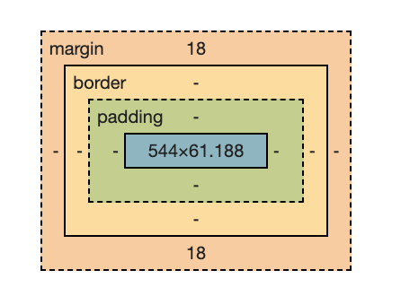

# CSS

## 반응형 웹의 3요소

- Fluid Grid
  - 가변 그리드
  - 플렉스박스 등
- Flexible Images
  - `%`로 이미지 크기 지정
  - `srcset`, `sizes` 속성 등으로 사용자의 뷰포트와 디바이스 해상도에 맞는 이미지 제공
- Media Queries
  - 뷰포트 너비를 테스트
  - breakpoints(분기점): 레이아웃이 변경되는 지점

&nbsp;

## CSS Selector가 어떠한 원리로 동작하나요?

- 선택자
  - `id`: `#header`, `#footer` 등
  - `class`: `.container`
  - 태그: `div`, `p`, `a`
  - 전체: `*`

1. 브라우저는 가져온 CSS를 구문 분석해 선택자 유형별로 다른 규칙을 다른 "버킷"으로 정렬(렌더 트리 생성)
   - 요소, 클래스, ID 등 찾은 선택자를 기반으로 DOM의 어느 노드에 어떤 규칙을 적용해야 하는지 결정
   - 필요에 따라 스타일을 첨부
2. 렌더 트리는 규칙이 적용된 후에 표시되어야 하는 구조로 배치
3. 페이지의 시각적 표시가 화면에 표시(페인팅)

&nbsp;

## 반응형 웹과 적응형 웹을 설명하시오.

- 반응형 웹
  - 사용자가 이용하고 있는 디바이스 해상도에 따라 웹사이트의 크기가 변경되는 것
- 적응형 웹
  - PC, 모바일 등 별도 구축

&nbsp;

## px, em에 대해 설명하시오.

- 절대 단위: 주변 요소에 영향을 받지 않고 고정된 수치(주로 `px`을 사용)
- 상대 단위: 화면의 크기에 따라 상대적인 비율로 확대 및 축소되는 단위
- `px`: 화면에서 가장 작은 단위
- `em`: 요소의 폰트 크기에 대한 상대적인 비율, 부모 요소의 폰트 크기를 기준으로 계산
- `ex`: 요소 글꼴 크기의 `x-height`
- `%`: 기본 글꼴 크기에 대하여 상대적인 값을 가짐
- `pt`: point, 일반 문서에서 많이 사용하는 단위

&nbsp;

## CSS 적용 우선순위

|    선택자     |                       설명                       | 환산점수 |
| :-----------: | :----------------------------------------------: | :------: |
| `!important`  | 우선순위 최상위 명령어, 속성값 바로 뒤에 넣는다. |  10,000  |
| 인라인 스타일 |       HTML 문서에서 태그 내에 style을 정의       |  1,000   |
| 아이디 선택자 |          태그 내에 id를 정의한 후 `#id`          |   100    |
| 클래스 선택자 |      태그 내에 클래스를 정의한 후 `.class`       |    10    |
|  태그 선택자  |            태그를 바로 선택자로 사용             |    1     |
|  전체 선택자  |                    요소 전체                     |    -     |

1. 기본적으로 뒤에 나오는 CSS가 우선순위가 높다.
2. `!important` > Inline Style Attribute > `id` > `class`, 다른 Attribute, 수도 클래스(`:first-child` 등) > Tag Attribute, 수도 엘리먼트(`::before` 등)
3. 우선순위가 같다면 개수가 많은 CSS가 우선순위가 높다.

&nbsp;

## CSS-in-JS에 대해서 설명해 주세요.

- 자바스크립트 코드에서 CSS를 작성하는 방식
  - Styled Component, emotion 등
- 런타임에서 해석/적용된다. → Zero Runtime CSS의 등장
- 장점
  - 지역 스코프 스타일
  - 코로케이션
    - 단일 컴포넌트에 관련된 모든 것을 같은 위치에 두는 것
  - 자바스크립트 변수를 style에 사용할 수 있다.
- 단점
  - CSS-in-JS는 런타임 오버헤드를 추가한다.
    - document에 삽입할 수 있는 일반 CSS로 스타일을 직렬화해야 한다.
  - CSS-in-JS는 번들 크기를 늘린다.
  - CSS-in-JS는 React Dev Tools를 어지럽힌다.

&nbsp;

## CSS 전처리기(CSS Preprocessor)의 장단점

- PostCSS + Tailwind CSS
- PostCSS
  - 플러그인 기반 아키텍처
  - 확장성
  - CSS 변환 및 최적화
  - CSS Next 및 미래의 CSS 문법 지원
  - 유연한 사용
- 장점
  - 유연성과 확장성
  - 미래 CSS 문법 지원
  - 코드 최적화
  - 브라우저 호환성 관리
  - 다양한 플러그인 생태계
- 단점
  - 높은 진입 장벽
  - 초기 설정 및 플러그인 관리
  - 플러그인 퀄리티 차이
  - 생태계 다양성
  - 프레임워크 부재

&nbsp;

## padding과 margin의 차이가 무엇인가요?

- `padding`: content와 border 사이의 여백을 나타내는 영역
- `margin`: border 바깥을 차지하는 영역
